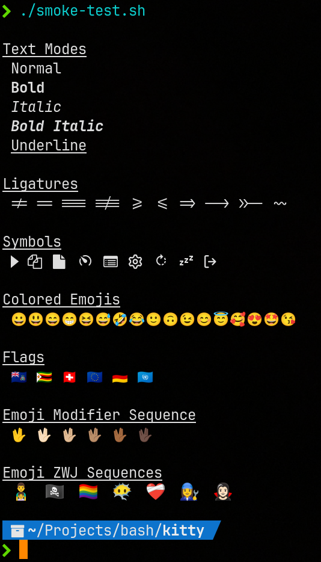

# BASH scripts for Kitty Terminal

## gen-symmap.sh


```
#: Fonts {{{

font_family      JetBrains Mono
bold_font        auto
italic_font      auto
bold_italic_font auto
```

Installed and for kitty useable fonts can be listed with ```kitty list-fonts```

No need to install patched fonts, just install the font containingthe symbols.

Generates ```symbol_map``` lines for ```kitty.conf``` out of the ```test-fonts.sh``` from Nerd Fonts to provide nerd symbols for a kitty terminal (https://github.com/kovidgoyal/kitty) with non-patched fonts.


```
# "Nerd Fonts - Pomicons"
symbol_map U+E000-U+E00D Symbols Nerd Font

# "Nerd Fonts - Powerline"
symbol_map U+E0A0-U+E0A2,U+E0B0-U+E0B3 Symbols Nerd Font

# "Nerd Fonts - Powerline Extra"
symbol_map U+E0A3-U+E0A3,U+E0B4-U+E0C8,U+E0CC-U+E0D2,U+E0D4-U+E0D4 Symbols Nerd Font

# "Nerd Fonts - Symbols original"
symbol_map U+E5FA-U+E62B Symbols Nerd Font

# "Nerd Fonts - Devicons"
symbol_map U+E700-U+E7C5 Symbols Nerd Font

# "Nerd Fonts - Font awesome"
symbol_map U+F000-U+F2E0 Symbols Nerd Font

# "Nerd Fonts - Font awesome extension"
symbol_map U+E200-U+E2A9 Symbols Nerd Font

# "Nerd Fonts - Octicons"
symbol_map U+F400-U+F4A8,U+2665-U+2665,U+26A1-U+26A1,U+F27C-U+F27C Symbols Nerd Font

# "Nerd Fonts - Font Logos"
symbol_map U+F300-U+F313 Symbols Nerd Font

# "Nerd Fonts - Font Power Symbols"
symbol_map U+23FB-U+23FE,U+2B58-U+2B58 Symbols Nerd Font

# "Nerd Fonts - Material Design Icons"
symbol_map U+F500-U+FD46 Symbols Nerd Font

# "Nerd Fonts - Weather Icons"
symbol_map U+E300-U+E3EB Symbols Nerd Font
```

## smoke-test.sh



